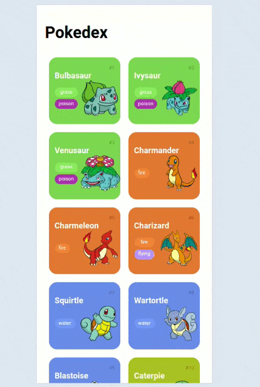

<h1> 👋 Hi, I’m @Rafabrendo</h1>

- 👀 I’m interested in learning about programming languages. Analyze and develop them, and the interaction of the algorithm and society.

 - 📫 How to reach me : https://www.linkedin.com/in/rafael-brendo

  
 - 🌱 I’m currently learning :

  
  
  
  
  
  
  
  
  
  
  
  
  
  
  

  

  
  
  

  
<!-- 
  visit count
  

     
<b>Visitors Count</b>
  
    

 
     
  

  
  --->

 

<!--
<picture>
<source
  srcset="https://github-readme-stats.vercel.app/api?username=Rafabrendo&show_icons=true&theme=dark"
  media="(prefers-color-scheme: dark)"
/>

</picture>
--->

<!---
Rafabrendo/Rafabrendo is a ✨ special ✨ repository because its `README.md` (this file) appears on your GitHub profile.
You can click the Preview link to take a look at your changes.
--->

## Java Projects
<ul>
  <li><a href="https://github.com/Rafabrendo/OO-e-Composicao/tree/main">Exercise Commercial bank(OOP)</a></li>
  <li><a href="https://github.com/Rafabrendo/Data-Structures">Data structure</a></li>
  <li><a href="https://github.com/Rafabrendo/chess-system-java">Chess game using OOP</a></li>
  <li><a href="https://github.com/Rafabrendo/rest-with-spring-boot-and-java-erudio">rest with spring boot and Java</a></li>
  <li><a href="https://github.com/Rafabrendo/workshop-spring-boot-mongodb">Workshop with spring boot and mongodb</a></li>

  <li><a href="https://github.com/Rafabrendo/jdbc-java">jdbc-java</a></li>

</ul>

    </img>

## JavaScript Projects

  </img>
  </img>

## Python Projects

## R Projects

## HTML/CSS Projects